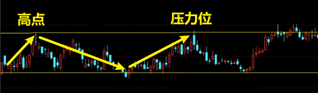
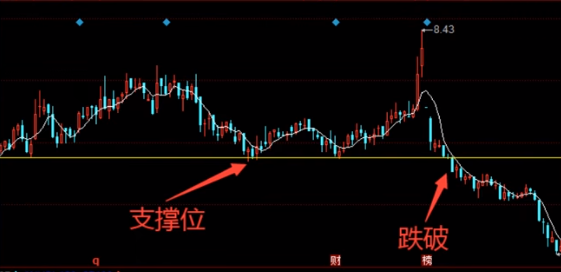

# 高低位买卖常识

## 1 压力位

含义：当股票再次上涨到上次增长趋势的高点时，这时可以考虑**卖出股票**。

**原理**：

因为有可能上次有人在高点买入，因为接下来股票开始跌了，购买者不想亏本卖掉，想着至少要等股票涨回来保本再卖，因此当股票再次回涨回购买者购买的价位时，购买者很可能会进行卖出，此时若购买者之前买了大量的股票，此时一旦卖出，恐会引起从众卖出的现象，进而导致股票下跌，因此，此时可以考虑卖出。

## 2 支撑位

>与压力位相反。

含义：当股票再次下跌到上次下跌趋势的低点时，这时可以考虑**买入股票**。

**原理：**

大多数人觉得上几次到这个低点时，都开始回涨了，这次也应该一样，在没有其这因素干扰的情况下，一旦买的人多了，股票增涨便成了理所当然的事。

## 3 突破

当股价上涨高过上次的高位时，并且感觉力量很大称之为突破，此次可以考虑**买入股票**。

## 4 跌破

当股价下跌高过上次的低位时，并且感觉力量很大称之为跌破，此次可以考虑**卖出股票**。

