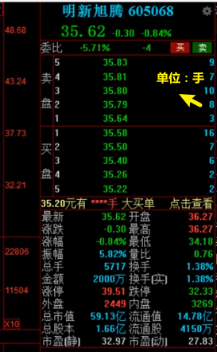

# 盘口与买卖机制

## 1 盘口

看当前的交易。

解释：

* `1手==100股`
* 涨跌：上个交易日的收盘价*涨幅
* 振幅：当天上涨的幅度+下跌的幅度
* 总手：成交量
* 金额：成交额
* 涨停：最高上涨价格
* 跌停：最低下跌价格
* 总市值：总股本*最新成交价格=`1.66亿*35.62=59.13亿`
* 流通股：总股本中可以买卖的股
* 流通值：流通股*最新成交价格=`4150万*35.62=14.78亿`

一般看流通值，流通值比较大称为大盘口，反之称为小盘口。

## 2 买卖机制

先到券商处开户。

### 2.1 仓位

仓位（持仓）：你用钱买入了股票，钱进入了股市流转，此时这笔钱称为你的持仓。

### 2.2 交易机制：T+1

可以挂一个买单等待成交，如果没成交，可以撤回。

但如果成交了，当天不可以卖出，要等当天之后的交易日才可以卖出。